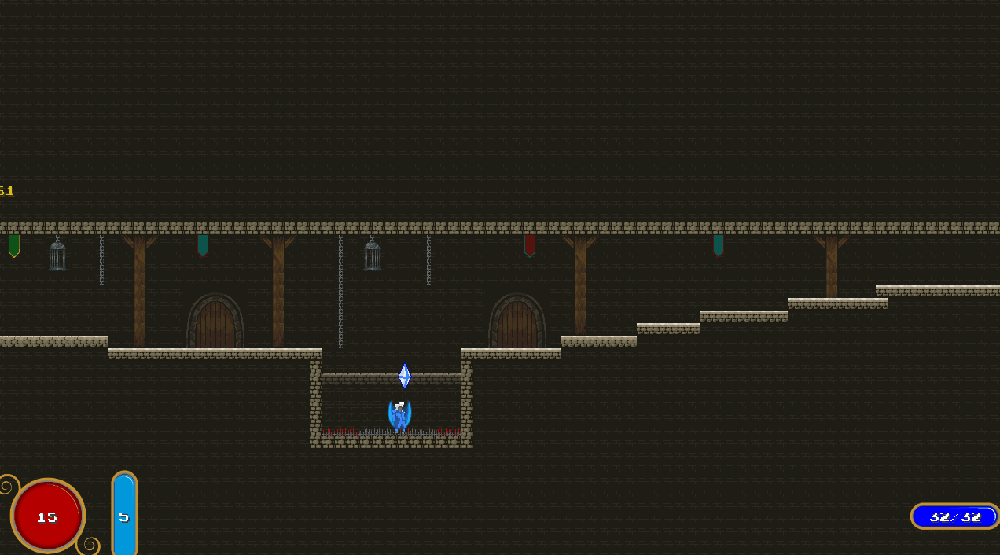
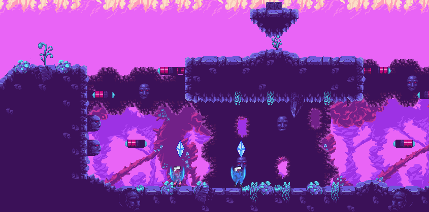
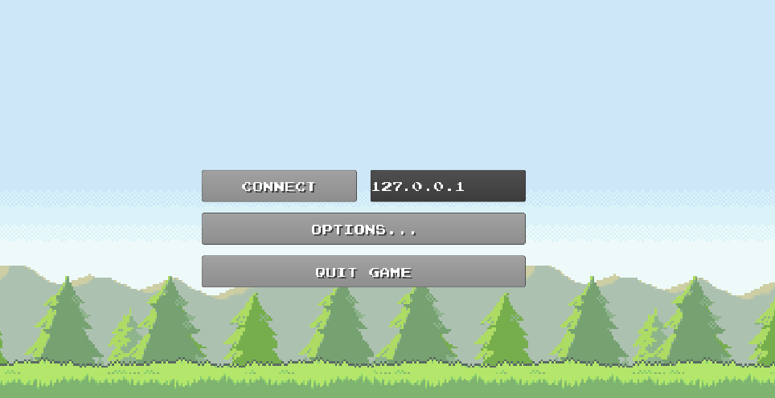

# Mage Showdown
> A 2D multiplayer shooter with mages. You can cast ice and fire spells, depending on what orb you're currently using, each type having a base spell and a bomb spell. Ice spells can freeze the opponent, whereas fire spells you can cast more often and deal more damage per second with. 

> Created using libgdx, box2d for the graphics and physics, kryonet for the networking part and java fx for the ui. The project was created with the help of https://github.com/HalalaiMircea.

## Gameplay Examples

## Credits

https://libgdx.badlogicgames.com/
https://github.com/EsotericSoftware/kryonet
https://bakudas.itch.io/generic-platformer-pack
https://codemanu.itch.io/pixelart-effect-pack
https://bakudas.itch.io/generic-dungeon-pack
https://mrbubblewand.wordpress.com/download/
